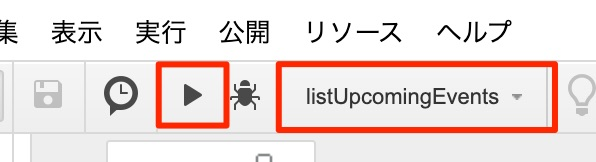
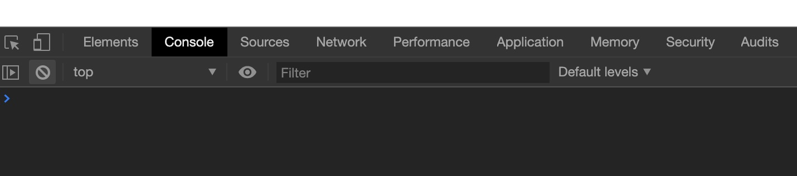
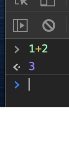
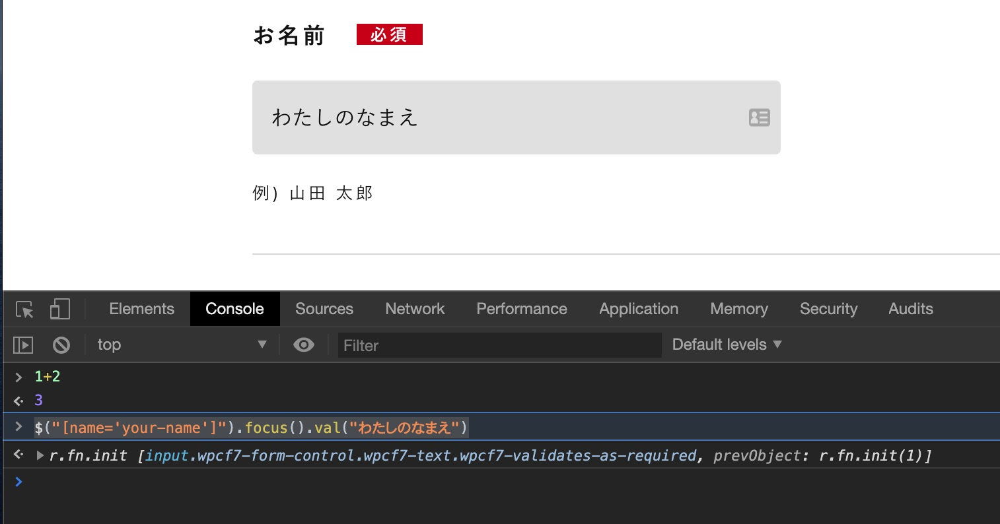

# このカリキュラムのゴール

まずはこのカリキュラムをやりきったときに、どのようなことができるようになるかを確認しましょう。

## Google Apps Script による Google系サービスの自動化

Google Apps Scriptは、Google のサービスの API を活用して Google サービスのデータを登録・取得などができるようになるものです。

[こちらのプログラム](https://script.google.com/d/1_F3NGHGzgn30wmB3hJwgLskwDe2fOHQB3-Jj6No9WWnYgvwU8cwJ8yTJ/edit?usp=sharing) を開いて、実行してみましょう。

- "listUpcomingEvents" が選択されているのを確認し、画面の三角のボタンを押します



- ダイアログが出てきたら、許可を確認 というボタンを押します
- 許可してください（途中、警告等が出ると思います。気にせずなんとか進めてください） 
- [表示] メニューから[ログ] を押すことで、直近10件のカレンダーに登録している予定が表示されていることがわかります。（予定が入っていなければ、カレンダーにテスト予定を作ってみましょう）

## ブラウザへの入力・ブラウザの自動操作

### bookmarklet/Chrome デベロッパーツール による入力

Chromeにはデベロッパーツールという開発者向けのツールがあり、そこからJavaScriptプログラムを実行することで、フォームの内容の自動入力などができます。

- [フォトクリエイトのその他のお問い合わせページ](https://www.photocreate.co.jp/contact/form_other/) を開きます
- Chromeのメニュー[表示]->[開発/管理]->[デベロッパーツール]を起動します
    - Windowsの場合はメニューの名前が違うそうなので、ショートカット：Ctrl+Shift+I が良いです。
- Console というタブを選択します



- 1+2 と入れてEnterすると計算が行われます（これもプログラミングの一種です）



- `$("[name='your-name']").focus().val("わたしのなまえ")` と入れてEnterを押すとフォームに入力が行われます



### puppeteerによるブラウザの操作

puppeteer（パペティアー）とは、"あやつり人形を操作するもの" という意味のツールで、ここではWebブラウザであるChromeをプログラミング言語の記述により自動操作してみます。

[こちらのプログラムをダウンロードして](../src/khdcorp.js) (別名で保存を選択して、`作業フォルダ=training-javascript`の中に保存して)実行してみます。

プログラムの実行の仕方は、コマンドプロンプトを用いて(Chromeのデベロッパーツールではないです！)

```sh
C:¥training-javascript> node khdcorp.js
```

のように入力します。
しばらく待つと、Chromeが起動してキタムラ・ホールディングスのサイトが表示された後、Chromeが終了します。

実行したフォルダに、screenshot.png というファイルができているので開いてみてください。

いかがでしょうか？面白そうでしょうか？難しそうでしょうか？

以上のようにこの研修カリキュラムでは、プログラミングによる業務効率化の一つの手法として、大きく分けて２つの方法を学んでいくことになります。

[次のコンテンツ：プログラミングの基礎](./basic)


