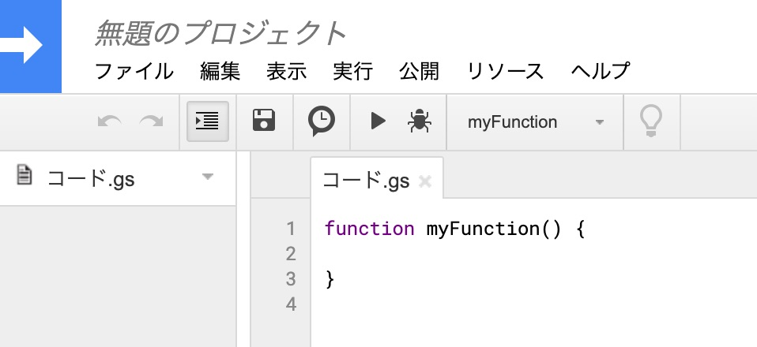
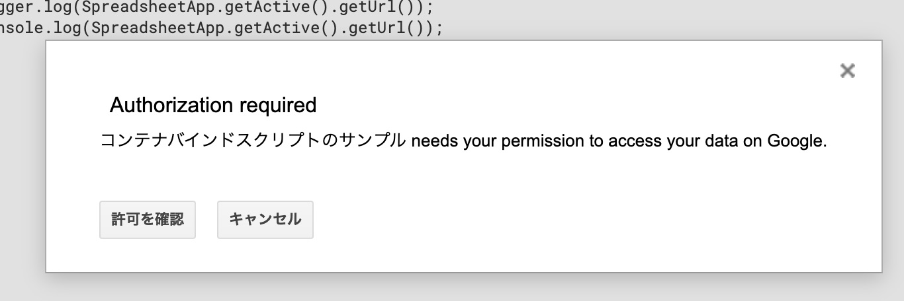
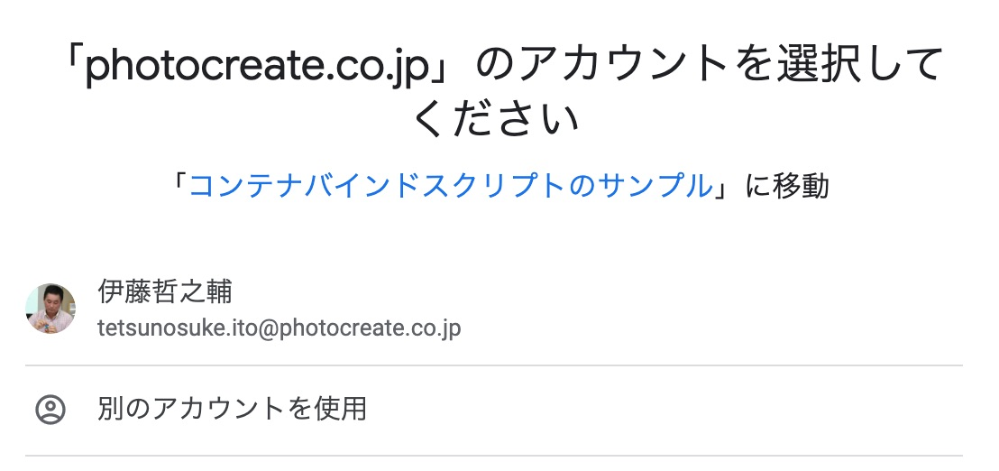
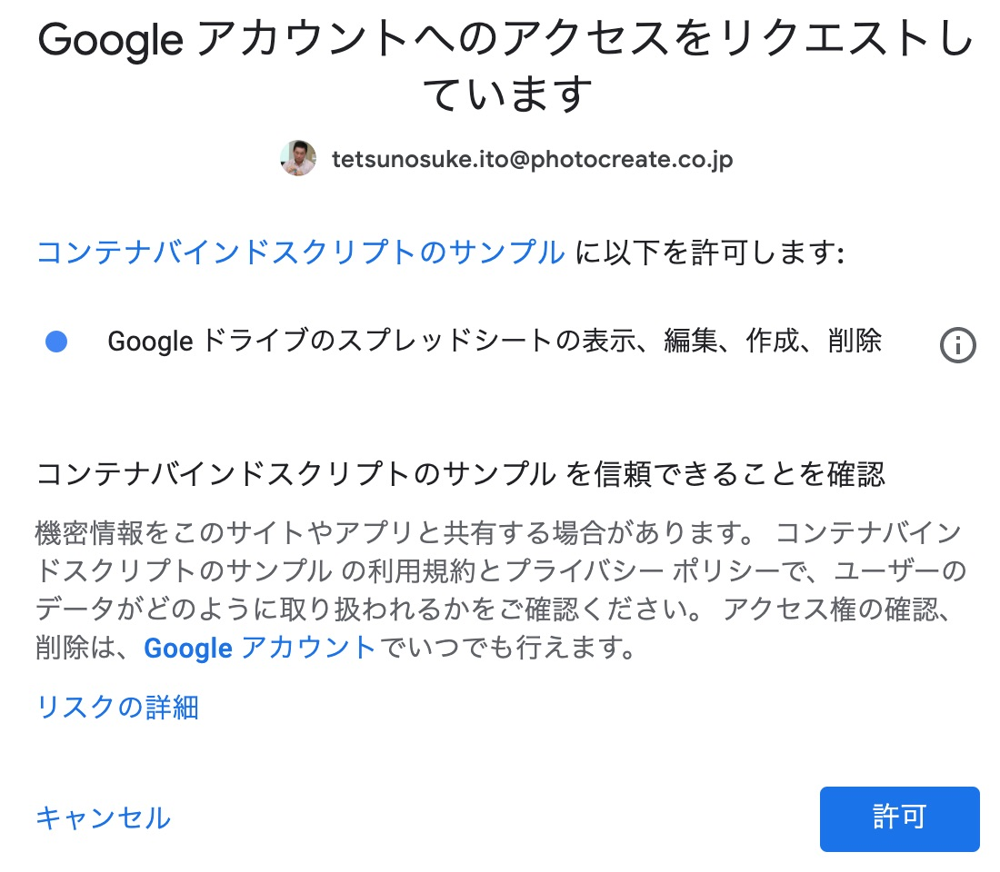
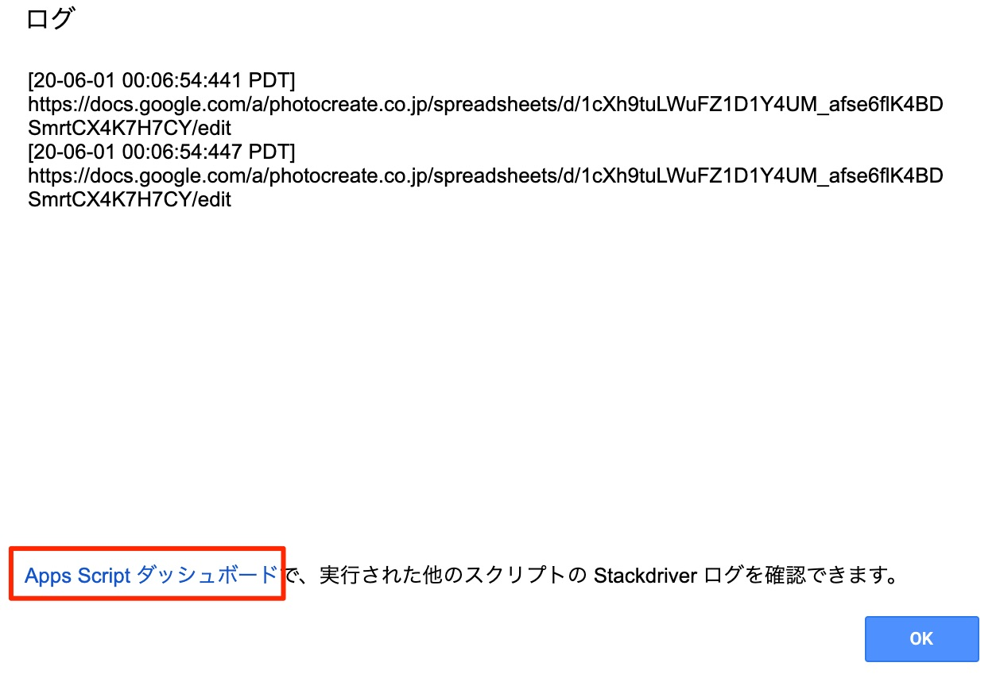
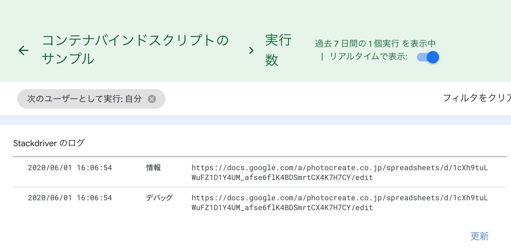
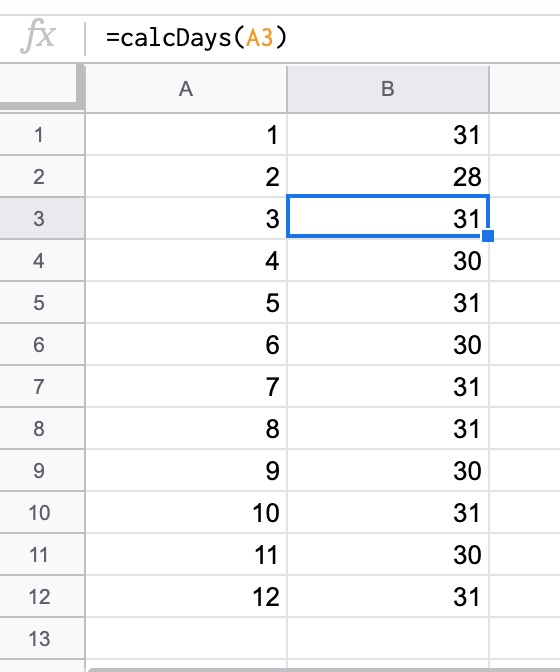

# Google Apps Script ハンズオンコンテンツ

ハンズオンとは体験学習を意味する方式です。比較的丁寧な説明がされている教材を用いて、まずは「そのとおりやってみる」ことで理解しながら（時にはハマりながら）問題を解決して理解を深めてください。

ここでは、Google Apps Scriptでできることを体験します。

## コンテナバインドスクリプトを理解してみよう

"コンテナバインドスクリプト" とは、スプレッドシートやGoogleフォームとの関連付けがされているプログラムのことを指します。

例えば「今開いているスプレッドシートで関数を使いたい」とか、「今開いているスプレッドシートで更新があった場合に通知する」などの利用法があります。

早速、スプレッドシートでコンテナバインドスクリプトを作成してみましょう。

### コンテナバインドスクリプトを書く
 
- https://spreadsheet.new/ を開き、新規スプレッドシートを起動します
- [ツール] メニューから [スクリプトエディタ] を選択します。
- Apps Script のスクリプトエディタが起動します



- コード.gs のところに下記のようにプログラムを書いて、実行してみましょう

```js
function myFunction() {
  // 下記の二行を追加する
  Logger.log(SpreadsheetApp.getActive().getUrl());
  console.log(SpreadsheetApp.getActive().getUrl());
}
```

- 下記のような画面が出てくるので"許可の確認" を押します



- アカウントを指定します



- 許可する対象の権限を確認し、許可します



- 実行が完了するので、メニュー[表示]->[ログ]を見てみると、ログが出ています。こちらのURLは呼び出し元のスプレッドシートのURLになっているはずです。




#### ログについて

ログはプログラミングにおいてとても大事です。特に初心者のうちはプログラムの途中経過はどうなっているのか？を調べるために有用です。

GoogleAppsScriptのログには二種類あります。

- Logger.log() を用いたログ
- console.log を用いたログ

カレンダーのサンプルでは Logger.log() が利用されていましたが、Progateでも学んだ、console.log() を使う、とおぼえておいて良いです。

このログはどこから見ることができるのか？それが、上の画像の"Apps Script ダッシュボード" です。



この変数の中身はなんだろう？と思ったら、 `console.log(変数);` や、 ``console.log(`iの値は${i}`);``のように変数をログに埋め込んで、中身を確認するようにしてみましょう。

### コンテナバインドスクリプトでスプレッドシートを操作する

例えばセルに記入された値に応じて文字の色を変えたり、背景色を変更してみましょう。（このくらいの内容であれば、条件付き書式でできると思いますが、練習なので）

スプレッドシートに適当に値を入力してみます。

プログラムにこのように追記し、setColors関数を実行してみてください。

```js
function setColors() {
  // 開いているシートを取得
  const sheet = SpreadsheetApp.getActive().getActiveSheet();
  // 値の入っているセル範囲を取得
  const range = sheet.getDataRange();
  // その範囲を #FF0000（赤）で塗りつぶす
  range.setBackground("#FF0000");

  // 興味があれば下記もやってみましょう
  // const range2 = sheet.getRange("A1:B5");
  // range2.setBackground("#0000FF");
}
```
例えばこのように、特定範囲に対して背景色をつけたり、罫線を引いたりという操作も、[こちらのリファレンス](https://developers.google.com/apps-script/reference/spreadsheet/range)を見ることでできるようになります。

#### 練習問題

(1) 下記のプログラムを修正し、指定した名前で新しいシートを作成するプログラムを作成しましょう。

ヒント： [SpreadSheetのリファレンス](https://developers.google.com/apps-script/reference/spreadsheet/spreadsheet) で "new sheet"を検索すると見つかりそうです。

```js
function createNewSheet() {
  // 開いているシートを取得
  const spreadSheet = SpreadsheetApp.getActive();
  // ここを埋めてみてください
  spreadSheet.????(????);
}
```

(2) シートの中の値にアクセスしてみましょう。シートに記入した値のうち、最も右下にある値を出してみましょう

```js
function getValuesAsAssociativeArray() {
  // 開いているシートを取得
  const sheet = SpreadsheetApp.getActive().getActiveSheet();
  // 値の入っているセル範囲を取得
  const range = sheet.getDataRange();
  // 値を連想配列としてログに出力してみましょう
  let associativeArray = range.getValues();
  console.log(associativeArray);
  // 配列として取得した値から、好きな値を取り出してみましょう
  console.log(associativeArray[??][??]);
}
```

### コンテナバインドスクリプトでカスタム関数を作る

sum() など、スプレッドシートに標準で組み込まれている関数以外にも、自分で便利な関数を作ることができます。

例えば、月を数字で入力したときにその月の日数を求める関数を書いてみます(複雑なので2月は28日で考えます)

```js
function calcDays(month) {
    // すでに習っているswitchを使って書いてみましょう
    let result;
    switch(month) {
        case 2:
            result = 28;
            break;
        case 4:
        case 6:
        case 9:
        case 11:
            result = 30;
            break;
        default:
            result = 31;
            break;
    }
    return result;
}
```

このような関数を書いて、A列に月を、B列に関数を図のように埋め込むことで関数が実行されます。




## その他のハンズオンコンテンツ

下記のコンテンツを用いて、そのとおりにやってみてください
- Google カレンダーに予定を登録してみよう
    - [GASでデフォルトのGoogleカレンダーにイベントを追加する簡単なスクリプト](https://tonari-it.com/gas-default-calendar-create-event/)
    - [GASでスプレッドシートの入力からGoogleカレンダーに複数のイベントを追加](https://tonari-it.com/gas-calendar-create-events-spreadsheet/)
- Gmailを操作してみよう
    - [GASでGmailを操作して日々の日報メールの下書きを自動で作成する](https://tonari-it.com/gas-gmail-create-draft/)

## 演習問題

その他のハンズオンコンテンツを探して、自分で同様にやってみてください。できあがったプログラムコードを提出してください。

## 応用問題

こちらの問題は余裕がある場合に限り着手してみてください。（日程の後半で実際に取り組んで頂く予定です）

Googleのサービスを活用して、どのようなことができたら嬉しいか考え、実際にそれができそうか調べてみてください。
可能そうであれば、それを作ってみましょう。

[目次へ戻る](../)
