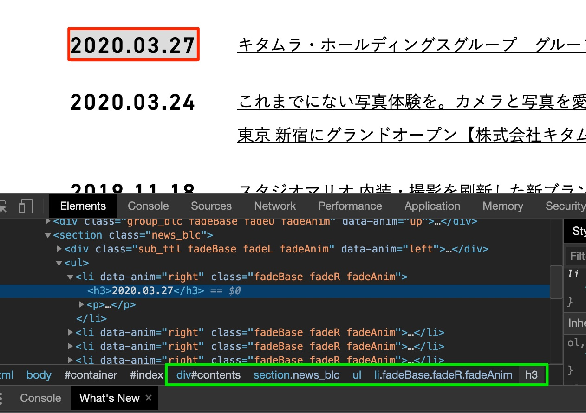

# Level3

ここまでのコンテンツでプログラミングの基本を学んできました。

ここでは、Chromeを操作していろいろなことを自動化するために学んでおくべき基本を学びます。

「基本」とありますが、とても難しい内容となっているので、よく理解しましょう。

## HTMLとDOM

DOM（ドム）とは、Document Object Model の略で、すでに学んだHTMLを、プログラムで扱うことのできるオブジェクトとして扱うために必要な概念です。

```html
<html>
  <head>
    <title>タイトル</title>
  </head>
  <body>
    <div class="main">
      <h1>見出し</h1>
    </div>
  </body>
</html>
```

HTMLは上記のように、開始タグ`<????>`から終了タグ`</????>`の集まりで作成されています。また、それぞれのタグには親子関係・兄弟関係があり：

- htmlの下には headとbodyが順に並んでいる
- bodyの下には divがあり、さらにその下にh1がある

というようになっています。

CSSを書く際に、class="main" の h1の文字サイズを変えようと思ったら

```css
.main h1 {
    font-size: 20px;
}
```

のように記載する、と学びましたが、この`.main h1` の部分を `セレクタ` と呼ぶとProgateに書いてありました。

ちなみにこれと、下記の、

```css
html body div.main h1 {
    font-size: 20px;
}
```

というのは同じ意味となります。つまり、`HTMLの中の特定の要素を指定する` 方法がこのセレクタであり、基本的には、何の下の何、という住所のような概念を利用できる方法がDOMだと思ってください。
CSSを書くときもこの概念をよく理解して、できるだけ簡潔な方法でセレクタを指定しましょう。

## セレクタの指定の方法いくつか

class="xxxx" は、 .xxxx という指定の仕方をすることはProgateに書いてありましたが、classというのは一つのHTMLファイルの中に複数書くことができます。そうすると、特定の要素を指定する際に class="xxxx" の中の上から3番目、という指定をする必要が出てきてしまい、ちょっとめんどくさいので HTMLにはこの名付けの方法のもう一つに、 id というものがあります。

Chromeで 'view-source:https://kitamura-group.co.jp/' を開いてみると、 id="container", id="contents" など、idが指定されています。

この id="xxxx" をセレクタで指定するには `#xxxx` という方法を利用しますので覚えてください。

### デベロッパーツールを用いてセレクタを確認する

セレクタを知るための一つの方法は、Chromeの画面で知りたい場所を選択し、右クリックして[検証]を押すと以下のような表示になります。



赤い部分が選択したところ。緑の部分がセレクタになります。（※classが複数あるときは、先頭の一つだけを残してください。例では #contents .news_blc ul `li.fadeBase` h3）

[キタムラ・ホールディングスのサイト](https://kitamura-group.co.jp/)を開き、 デベロッパーツールの Console のタブにて

```js
console.log(document.querySelector("#contents .news_blc ul li.fadeBase h3"));
```

と入力すると

h3のタグで囲まれた欲しいところだけを取得できることがわかります。

## その他のセレクタ

フォームの要素は `<input type="text" name="email">` のように、nameがついているのが一般的です。

この場合のセレクタは `[name="email"]` のように書きます。

以前試した、 [フォトクリエイトのその他のお問い合わせページ](https://www.photocreate.co.jp/contact/form_other/)で、 

```js
console.log(document.querySelector('[name="your-name"]'));
```

と入れてみるとinputタグの欲しいところを取得できることがわかります。

以上の知識を用いて、ブラウザの自動操作を行うことが出来ます。試行錯誤しながらになりますが、この基本を学ぶことで、下記のようなことができるようになっていきます。

- リンクのクリック
- フォームの自動入力（プルダウンの変更, ラジオボタンのチェックなど）
- ボタンを押す（フォームの送信）
- 特定のパーツの文字列を取得
    - プログラミングなので、その値に応じた処理
- 画面キャプチャの取得

例えば...勤労の獅子の打刻をしたい！と思ったら以下の手順となります。

- 法人コードを入力
- 社員コードを入力
- パスワードを入力
- ログインボタンを押す
- 必要であれば出勤ボタンまたは退勤ボタンを押す
- 打刻ボタンを押す
- がんばれば、打刻漏れの日の全てを打刻漏れとして修正も記入できそう！

その他にも最近こそ減りましたがブラウザでできる系のソシャゲがはかどりそうですね。

次のコンテンツでは、puppeteerでできることの詳細を紹介します。

[次のコンテンツ：Puppeteerでできること](./puppeteer)
