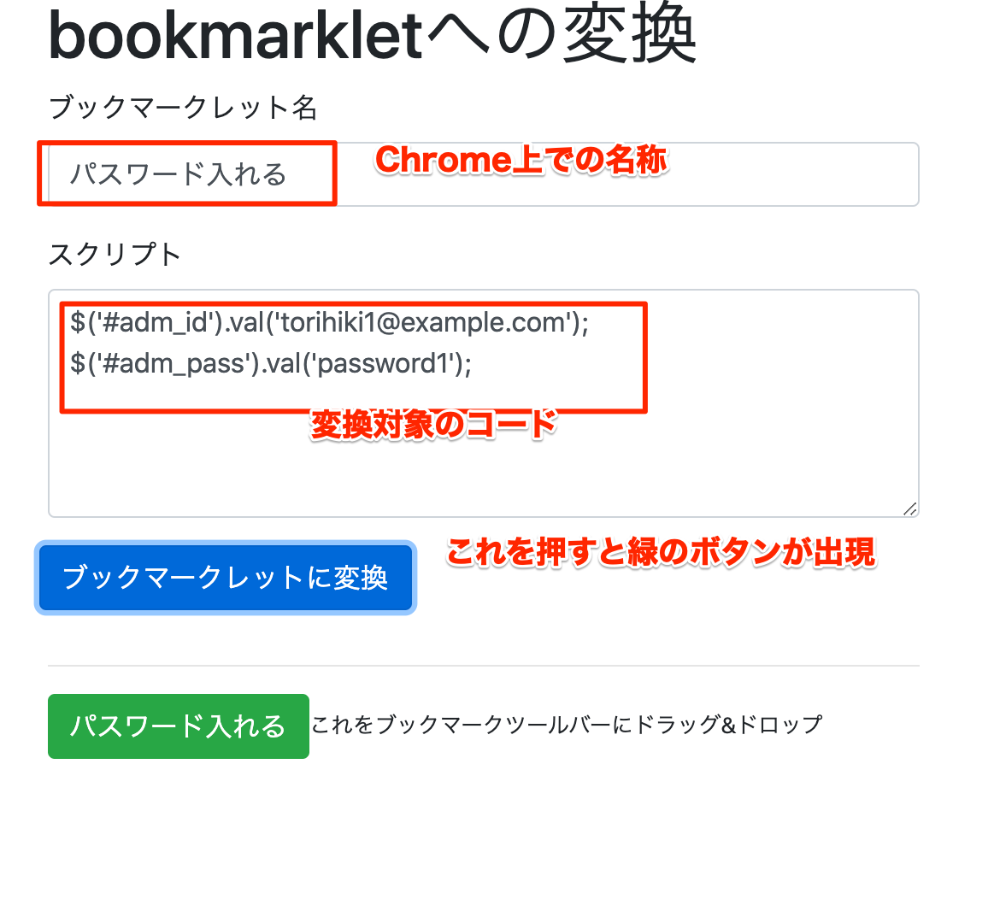

# 参考資料

## ブックマークレットについて

puppeteer を用いて画面から必要なデータを取得する場合、ログインなど最初からやらないといけないので、やや面倒です。現在見ている画面に対して何かしらの処理を行う場合はブックマークレットという仕組みを活用したり、デベロッパーコンソールにコードを入力することで便利に使える技があります。

例） おいたちフォトへのログインで、ABCD-EFGH-JKLM-OPQR というパスワードがあるが、入力欄が4つに別れているのでコピペで埋めるのが面倒

以下のような手順でこの問題を解消します。

まず、一旦デベロッパーコンソールでこの問題を解決するプログラムを作ります。

```javascript
// 一旦ログインできるパスワードをconstで定義します
const password = "ABCD-EFGH-IJKL-MNOP";
// https://photochoice.jp/event-subcategory/oitachi を開いてセレクタを確認します
// 入力欄は #password_unlock_history_with_serialcode_code1, password_unlock_history_with_serialcode_code2 ... 
// のようになっていることがわかったので、それぞれのセレクタを用いて値を埋め込みます。
// また、このサイトでは jQuery が使われているので、各idで指定されたフィールドには $("#id").val("テキスト"); とすれば
// 値が入力できます。つまり...
$("#password_unlock_history_with_serialcode_code1").val("ABCD");
$("#password_unlock_history_with_serialcode_code2").val("EFGH");
$("#password_unlock_history_with_serialcode_code3").val("IJKL");
$("#password_unlock_history_with_serialcode_code4").val("MNOP");
// のようになれば動くということです
```

これだとプログラムになっていないので、 passwordを `-` で分割して、 配列valsに入れたものを使うと以下のようにできます

```javascript
const password = "ABCD-EFGH-IJKL-MNOP";
let vals = password.split("-");
for(let i=0; i < vals.length; i++) {
    $(`#password_unlock_history_with_serialcode_code${i+1}`).val(vals[i]);
}
```

あとは、パスワードを自分で変更できるようにしましょう。prompt 関数を使うと、入力を求めるメッセージを出すことができます。

```javascript
const password = prompt("パスワードを入れてください");
let vals = password.split("-");
for(let i=0; i < vals.length; i++) {
    $(`#password_unlock_history_with_serialcode_code${i+1}`).val(vals[i]);
}
```

これで、このプログラムをどこかに(VisualStudioCodeなどで）保存しておけば、この手間を省くことができます。（が、このままだと、それを起動するほうがめんどくさいので、これをボタン一発で起動する方法があります。それがブックマークレットです。その方法はあとで説明します）


例）RESERVA という予約管理システムにログインしたいが、取引先ごとにID/パスワードが別々になっており面倒

予約管理システム：　https://reserva.be/rsv/login

取引先がスプレッドシートにこのように別れているとします。

||A|B|
|----|-----|
|1|ログイン用メールアドレス|ログイン用パスワード|
|2|torihiki1@example.com|password1|
|3|torihiki2@example.com|password2|
|4|torihiki3@example.com|password3|
|5|torihiki4@example.com|password4|

RESERVAのサイトも同様にjQueryが使われているので、下記のようなコードでID, パスワードを埋めることが出来ます。

```javascript
$("#adm_id").val("torihiki1@example.com");
$("#adm_pass").val("password1");
```

これを貼り付けられるように、スプレッドシートにC列を追加し

```
=concatenate("$('#adm_id').val('", A2, "'); $('#adm_pass').val('", B2, "');")
```

のように関数を入れれば

```
$('#adm_id').val('torihiki1@example.com'); $('#adm_pass').val('password1');
```

のようなプログラムコードを得ることができます。

## ブックマークレットの作り方

上記で書いたコードをボタン一発で呼び出せるようにするには、ブックマークレットという形式にする必要があります。

ブックマークレットにするには以下の2つが必要です。

1. プログラムを `javascript:(function(){` と `})();` で囲う
2. ブラウザのブックマークのURLに登録する

### ブックマークレット作成サービスを作りました

[ブックマークレット変換ツール](https://affectionate-cori-9216d0.netlify.app/)



